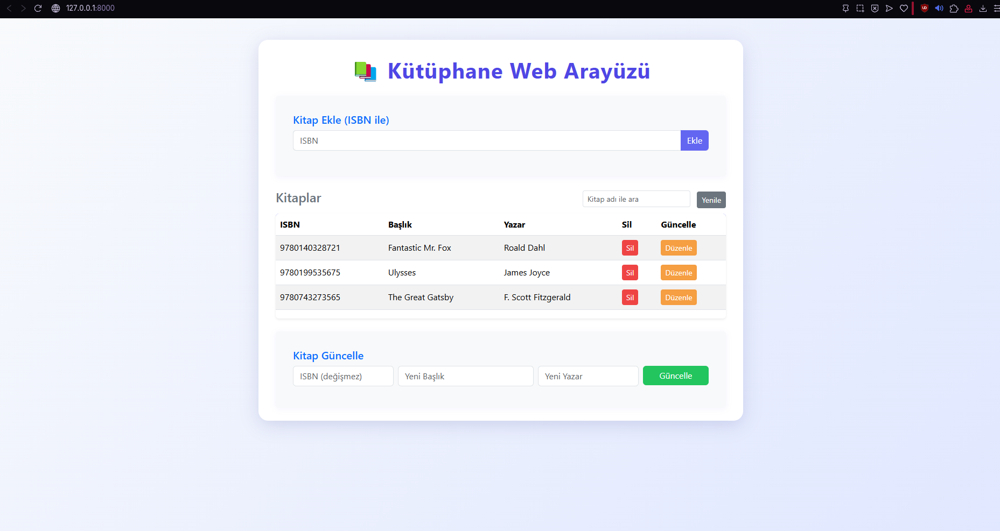

## 📚 Kütüphane Yönetim Sistemi


<p align="center">
  
</p>

Basit bir terminal uygulamasından başlayıp, ISBN ile Open Library API'dan veri çeken ve FastAPI ile web servisine dönüşen bir kütüphane uygulaması. Veriler SQLite veritabanında saklanır ve arayüz olarak sade bir HTML/JS dosyası sağlanır.

---

### 🔗 İçerik
- [Kurulum](#-kurulum)
- [Kullanım](#-kullanım)
  - [Terminal Uygulaması](#terminal-uygulaması-aşama-1-ve-2)
  - [API Sunucusu](#api-sunucusu-aşama-3)
  - [Web Arayüzü](#web-arayüzü)
- [API Dokümantasyonu](#-api-dokümantasyonu)
  - [Endpoint Listesi](#endpoint-listesi)
  - [Örnek POST İsteği](#örnek-post-isteği)
- [Örnek ISBN'ler](#-örnek-isbnler)
- [Proje Yapısı](#-proje-yapısı)
- [Testler](#-testler)
- [Notlar](#-notlar)

---

## 🚀 Kurulum

1) Repoyu klonlayın
```sh
git clone <repo-url>
cd "Kütüphane Yönetim Sistemi"
```

2) Bağımlılıkları kurun
```sh
pip install -r requirements.txt
```

---

## 🧭 Kullanım

### Terminal Uygulaması (Aşama 1 ve 2)
```sh
python main.py
```
- Menüden kitap ekleyebilir, silebilir, listeleyebilir veya arayabilirsiniz.
- Kitap eklerken sadece ISBN girmeniz yeterlidir; başlık ve yazar otomatik alınır.

### API Sunucusu (Aşama 3)
```sh
uvicorn api:app --reload
```
- Tarayıcıdan `http://127.0.0.1:8000` adresine giderseniz web arayüzü açılır.
- FastAPI etkileşimli dökümantasyon: `http://127.0.0.1:8000/docs`

### Web Arayüzü
- Sunucu çalışırken tarayıcıdan `http://127.0.0.1:8000` adresine gidin.
- ISBN ile kitap ekleme, listeleme, silme ve güncelleme işlemlerini görsel arayüzden yapabilirsiniz.

---

## 📘 API Dokümantasyonu

### Endpoint Listesi
- **GET `/books`**: Tüm kitapları JSON olarak döndürür.
- **POST `/books`**: ISBN ile kitap ekler. Body: `{ "isbn": "9780140328721" }`
- **DELETE `/books/{isbn}`**: Belirtilen ISBN'e sahip kitabı siler.
- **PUT `/books/{isbn}`**: Kitabın başlık ve yazarını günceller. Body: `{ "title": "Yeni Başlık", "author": "Yeni Yazar" }`

### Örnek POST İsteği
- cURL ile:
```bash
curl -X POST "http://127.0.0.1:8000/books" \
  -H "Content-Type: application/json" \
  -d "{\"isbn\":\"9780140328721\"}"
```

- HTTPie ile:
```bash
http POST :8000/books isbn=9780140328721
```

- Beklenen başarılı yanıt (200 OK):
```json
{ "title": "Matilda", "author": "Roald Dahl", "isbn": "9780140328721" }
```

- Bulunamazsa (404):
```json
{ "detail": "Kitap bulunamadı." }
```

---

## 🔢 Örnek ISBN'ler
- 9780140328721 (Matilda)
- 9780439139601 (Harry Potter and the Goblet of Fire)
- 9780199535675 (Ulysses)
- 9780743273565 (The Great Gatsby)

---

## 🗂 Proje Yapısı
```
Kütüphane Yönetim Sistemi/
├─ api.py          # FastAPI uygulaması ve endpoint'ler
├─ library.py      # SQLAlchemy modelleri ve iş mantığı (SQLite)
├─ main.py         # Terminal uygulaması (menü)
├─ web.html        # Basit web arayüzü (HTML/JS)
├─ requirements.txt
├─ tests/
│  ├─ test_api.py
│  └─ test_library.py
└─ README.md
```

---

## ✅ Testler
```sh
pytest
```

---

## 📝 Notlar
- Veritabanı SQLite'tır. `library.db` yoksa ilk çalıştırmada otomatik oluşturulur.
- ISBN ile ekleme için internet bağlantısı gerekir (Open Library API).
- Tavsiye edilen `.gitignore` girdileri:
  - `library.db`
  - `__pycache__/`

---

Hazırsınız! Sorularınız veya geliştirme önerileriniz için issue açabilirsiniz. 🙌
